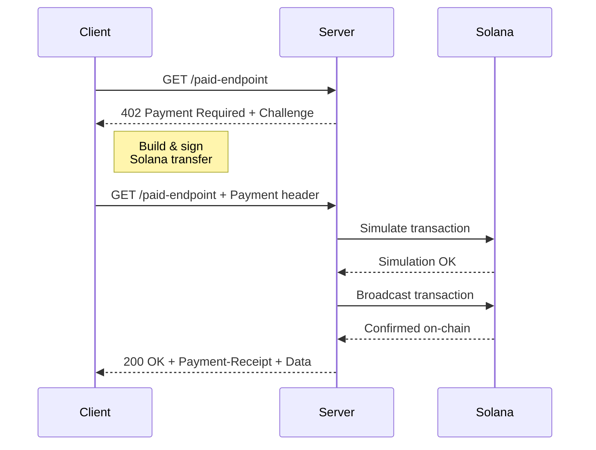

# 402 — Builders Network

## Quick Start

An ephemeral Solana network for builders integrating [x402](https://x402.org) payments and [mpp.dev](https://mpp.dev) tooling. Use the faucet to get tokens and start building payment flows, token gating, and monetization features.

### RPC

```txt
https://402.surfnet.dev:8899
```

### WebSocket

```txt
wss://402.surfnet.dev:8900
```

## What You Can Build

### Token-Gated APIs & Content
Test HTTP 402 payment flows end-to-end — request tokens from the faucet, mint SPL tokens, and gate access to APIs or content using x402.

### Payment Integrations
Build and test Solana payment flows with instant finality. No rate limits, no mainnet costs — iterate fast on token transfers, subscriptions, and micropayments.

### Agent-to-Agent Payments
Prototype autonomous agent tabs using mpp.dev. Test machine-payable endpoints where AI agents pay for resources with Solana tokens.

### Token Operations
Create mints, distribute tokens, and test token account management in a disposable environment that resets cleanly.

## Machine Payments Protocol (MPP)

[`@solana/mpp`](https://www.npmjs.com/package/@solana/mpp) is the Solana payment method for the [Machine Payments Protocol](https://mpp.dev). It lets any HTTP API accept payments using the `402 Payment Required` flow.

### Install

```bash
pnpm add @solana/mpp
```

### Server

```ts
import { Mppx, solana } from '@solana/mpp/server'

const mppx = Mppx.create({
  secretKey: process.env.MPP_SECRET_KEY,
  methods: [
    solana.charge({
      recipient: 'RecipientPubkey...',
      currency: 'EPjFWdd5AufqSSqeM2qN1xzybapC8G4wEGGkZwyTDt1v',
      decimals: 6,
    }),
  ],
})

const result = await mppx.charge({
  amount: '1000000', // 1 USDC
  currency: 'USDC',
})(request)

if (result.status === 402) return result.challenge
return result.withReceipt(Response.json({ data: '...' }))
```

### Client

```ts
import { Mppx, solana } from '@solana/mpp/client'

const mppx = Mppx.create({
  methods: [solana.charge({ signer })], // any TransactionSigner
})

const response = await mppx.fetch('https://api.example.com/paid-endpoint')
```

### How It Works



See the full SDK at [github.com/solana-foundation/mpp-sdk](https://github.com/solana-foundation/mpp-sdk).

## Resources

- [payments.org](https://payments.org) — Payments on Solana
- [x402.org](https://x402.org) — HTTP 402 payment protocol
- [mpp.dev](https://mpp.dev) — Machine-payable pages
- [@solana/mpp on npm](https://www.npmjs.com/package/@solana/mpp) — MPP SDK
- [solana-foundation/mpp-sdk](https://github.com/solana-foundation/mpp-sdk) — MPP SDK source
- [Solana Developer Docs](https://docs.solana.com/)

## Support

Need help? Reach out to the Solana community:
- [Solana Stack Exchange](https://solana.stackexchange.com/)
- [Developer Documentation](https://docs.solana.com/)
